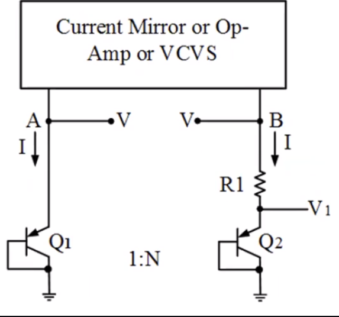
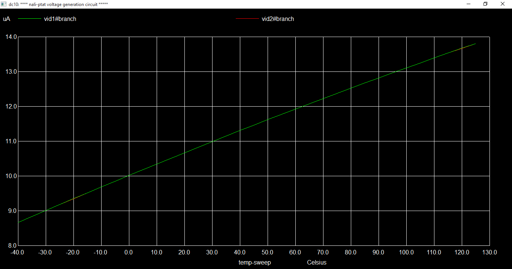
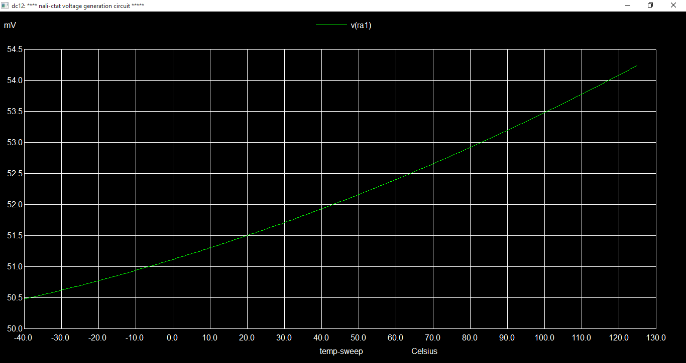

# VSDOpen21_BGR_Workshop


# Table of Contents
- [Introduction](#introduction)
- [EDA Tools Used](#eda-tools-used)
- [Pre-layout](#Pre-layout)
- [Post-layout](#Post-Layout)
- [ Report by](#Report-by)
- [ Acknowledgments](#acknowledgments)
- [References](#References)


# Introduction

- Temperature-Independent voltage reference circuits are  widely used in ICs.
- It Produces constant voltage regardless of vcc variation, temp. changes.
- Power supply like battery is unsuitable for use as a reference voltage source and its voltage drops over time. so, it is also not suitable.
- A Bandgap reference circuit that can be integrated into CMOS, Bi-CMOS, or Bipolar technologies without the use of external components. So, BGR is more prefered.


## CTAT


## PTAT


## Self-Bias Current Mirror


## Startup Circuit


## BGR Circuit


# EDA Tools Used 
The design has been built using open-source EDA tools. The library used is osu180nm. 

🌟 Ngspice
 
   * Ngspice is a mixed-level/mixed-signal electronic circuit simulator.
   * Ngspice is based on three open-source free-software packages: 
      * Spice3f5
      * Xspice
      * Cider1b1
   
      🔗 http://ngspice.sourceforge.net/
      
 🌟 Magic
 
  * Magic is a venerable VLSI layout tool, written in the 1980's at Berkeley by John Ousterhout, now famous primarily for writing the scripting interpreter language Tcl. Due largely in part to its liberal Berkeley open-source license, magic has remained popular with universities and small companies.
  * The open-source license has allowed VLSI engineers with a bent toward programming to implement clever ideas and help magic stay abreast of fabrication technology. However, it is the well thought-out core algorithms which lend to magic the greatest part of its popularity.
  * Magic is widely cited as being the easiest tool to use for circuit layout, even for people who ultimately rely on commercial tools for their product design flow.
  
    🔗 http://opencircuitdesign.com/magic/


# Pre-layout 

## BGR tt Corner


## BGR ff Corner


## BGR ss Corner


## BGR various Supply


## Ideal opamp BGR


## CTAT


## FET 


## PTAT




## Resistor





# Post-layout 

## Nfet


## Nfets


## Pfet


## Pfets


## PNP


## Resistors


## Resistor bank


# Startup Circuit


## BGR Circuit


## Post layout Simulation


## LVS Check

To perform the lvs check give the following command

``` 
lvs pre_layout.spice post_layout.spice <netgen_rule.tcl> 
```


## Report By

🖊️  Nalinkumar S , B.E (Electronics and Communication Engineering), Madras Institute of Technology, Anna University, Tamil Nadu 

##  Acknowledgments


- Dr. Saroj Rout, Adjunct Prof., SIT Bhubaneswar
- Dr. Santunu Sarangi, Asst Prof., SIT Bhubaneswar
- Kunal Ghosh, Co-founder, VLSI System Design (VSD) Corp. Pvt. Ltd. - kunalpghosh@gmail.com

##  References

- https://github.com/vsdip/vsdopen2021_bgr.git

